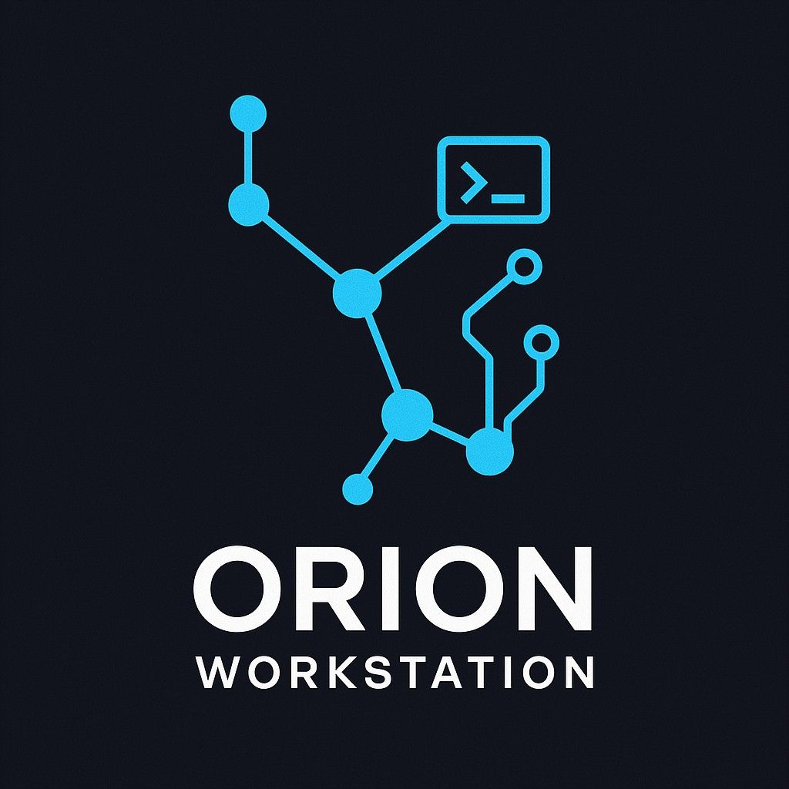
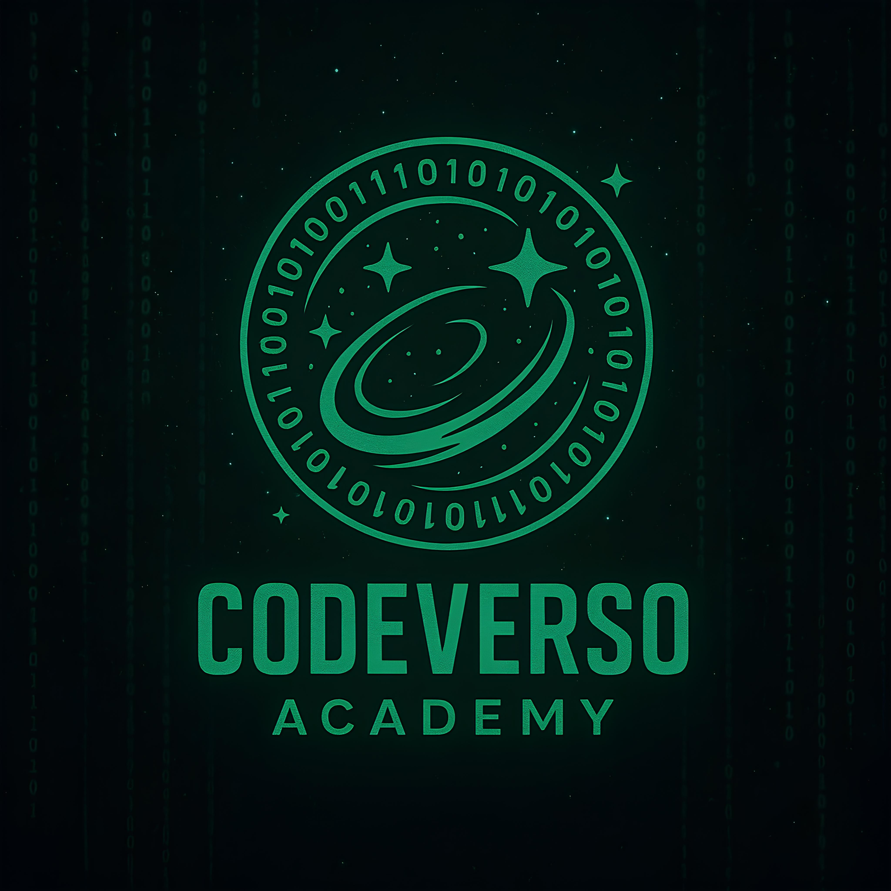

# 🌌💻⚙️ Orion Workstation on WSL2

<p align="center">
    
</p>

> Automatização para configuração de ambiente de desenvolvimento no WSL2 Ubuntu, utilizando Ansible para agilizar e padronizar a instalação de ferramentas e configurações essenciais para profissionais DevOps.
> "Automatize tudo o que puder, documente o resto."

_**Feito com ❤️ para otimizar o tempo de desenvolvedores DevOps**_

---

## 📑 Sumário
- [Sobre o Projeto](#-sobre-o-projeto)
- [Estrutura do Projeto](#-estrutura-do-projeto)
- [Roadmap](#-roadmap)
- [Funcionalidades](#-funcionalidades)
- [Pré-requisitos](#-pré-requisitos)
- [Instalação](#-instalação)
- [Configuração do Windows Terminal](#️-configuração-do-windows-terminal)
- [Uso](#-uso)
- [Desfazendo as Alterações](#-desfazendo-as-alterações)
- [Variáveis do Sistema](#-variáveis-do-sistema)
- [Licença](#-licença)
- [Contato](#-contato)

## 🚀 Sobre o Projeto

O **Orion Workstation** é um conjunto de automações para provisionar rapidamente um ambiente de desenvolvimento DevOps completo no WSL2 Ubuntu, utilizando Ansible. O objetivo é padronizar e acelerar a configuração de ferramentas essenciais, shells modernos, utilitários, servidores, bancos de dados, ferramentas de containerização, infraestrutura como código e monitoramento, tudo de forma modular e personalizável.

Com este projeto, profissionais DevOps podem economizar tempo, evitar configurações manuais repetitivas e garantir ambientes consistentes entre diferentes máquinas e equipes. Cada etapa do setup pode ser ativada ou desativada conforme a necessidade, tornando o processo flexível e adaptável a diferentes cenários de uso.

A documentação detalha cada funcionalidade, pré-requisitos e instruções para instalação, uso e personalização, facilitando a adoção tanto por iniciantes quanto por usuários avançados.

## 📁 Estrutura do Projeto

```
.
├── LICENSE
├── README.md
├── assets
│   ├── CodeVerso-Academy.jpg
│   └── Orion-Workstation-Project.jpg
├── collections
│   └── requirements.yml
├── group_vars
│   └── all.yml
├── installation_check.py
├── roles
│   ├── docker_container
│   │   ├── defaults
│   │   │   └── main.yml
│   │   ├── handlers
│   │   │   └── main.yml
│   │   └── tasks
│   │       └── main.yml
│   ├── kubernetes_orchestration
│   │   ├── defaults
│   │   │   └── main.yml
│   │   ├── handlers
│   │   │   └── main.yml
│   │   └── tasks
│   │       └── main.yml
│   ├── oh_my_zsh
│   │   ├── defaults
│   │   │   └── main.yml
│   │   └── tasks
│   │       └── main.yml
│   ├── packages_optional
│   │   ├── defaults
│   │   │   └── main.yml
│   │   └── tasks
│   │       └── main.yml
│   └── update_system
│       └── tasks
│           └── main.yml
├── rollback.yml
├── rollback_check.py
└── site.yml
```

## 🌍 Roadmap

Este projeto está em constante evolução para oferecer um ambiente DevOps cada vez mais completo. Ao longo de 2025, novas ferramentas e configurações serão integradas. Confira as etapas planejadas e em andamento:

- [x] Atualização e Upgrade do Sistema Operacional
- [x] Instalação de utilitários: Instalação de pacotes opcionais
- [x] Terminal Moderno: Instalação e Customização com Oh-My-ZSH, Powerlevel10k e Plugins
- [x] Containerização: Docker Engine e Docker Compose v2
- [x] Orquestração e Ferramentas Kubernetes: `kubectl`, `kubelet`, `kubeadm`, `minikube`, `helm`, `k9s`
- [ ] Servidores Web Populares: `nginx`, `apache2`
- [ ] Bancos de Dados Essenciais: `PostgreSQL`, `MongoDB`, `MySQL`
- [ ] Monitoramento e Observabilidade: `Prometheus`, `Grafana`, `Zabbix`
- [ ] Infraestrutura como Código: `OpenTofu`, `Terraform`, `Puppet`
- [ ] CLIs de Nuvem: `AWS CLI`, `Azure CLI`, `Google Cloud CLI`

> 🔄 *Este projeto está em desenvolvimento ativo. Novas funcionalidades e melhorias são adicionadas regularmente. Contribuições e sugestões são bem-vindas!*

## 💡 Funcionalidades

O playbook automatiza as seguintes configurações e instalações essenciais para um ambiente DevOps moderno:

1. **Atualização e aprimoramento do sistema operacional**
    - Atualização dos repositórios e pacotes
    - Upgrade de segurança e limpeza de dependências

2. **Instalação de utilitários**
    - Instalação de pacotes opcionais para o ambiente de desenvolvimento

3. **Terminal moderno**
    - Setup do Oh-My-ZSH com tema Powerlevel10k
    - Instalação e configuração de plugin (syntax highlighting)
    - Customização do prompt e variáveis de ambiente

4. **Containerização**
    - Instalação completa do Docker Engine e Docker Compose v2
    - Configuração de permissões em grupo para uso do Docker sem sudo

5. **Orquestração e ferramentas Kubernetes**
    - Instalação do kubectl, kubelet, kubeadm, minikube, helm e k9s

6. **Servidores Web** _(em desenvolvimento)_
    - Instalação do nginx e apache2

7. **Bancos de Dados** _(em desenvolvimento)_
    - Instalação do PostgreSQL, MongoDB e MySQL

8. **Monitoramento e Observabilidade** _(em desenvolvimento)_
    - Instalação do Prometheus, Grafana e Zabbix

9. **Infraestrutura como Código** _(em desenvolvimento)_
    - Instalação do Terraform, OpenTofu e Puppet

10. **Ferramentas de Cloud CLI** _(em desenvolvimento)_
    - Instalação do AWS CLI, Azure CLI e Google Cloud CLI


> Todas as etapas são opcionais e podem ser customizadas conforme a necessidade do usuário, garantindo flexibilidade e padronização do ambiente.

### 🎛️ Personalização via [`group_vars/all.yml`](group_vars/all.yml)

Você pode controlar quais etapas do playbook serão executadas editando o arquivo. Para cada seção, há variáveis booleanas (`true` ou `false`) que ativam ou desativam a instalação/configuração correspondente. Basta definir como `true` para habilitar ou `false` para pular aquela etapa.

Assim, você tem total controle sobre o que será instalado no seu ambiente.

## 📋 Pré-requisitos

- WSL2 instalado com Ubuntu
- Acesso à internet
- Privilégios de administrador
- Windows Terminal (recomendado)

## 🔧 Instalação

### 1. Instalar o Ansible

```bash
# Atualizar os repositórios
sudo apt update

# Instalar o software-properties-common
sudo apt install software-properties-common

# Adicionar o repositório do Ansible
sudo apt-add-repository --yes --update ppa:ansible/ansible

# Instalar o Ansible
sudo apt install ansible
```

### 2. Clonar o Repositório

```bash
git clone https://github.com/messias-code/orion-workstation
cd orion-workstation
```

### 3. Instalar as Dependências (Collections)
O projeto utiliza collections do Ansible Galaxy para estender suas funcionalidades. Instale todas as dependências necessárias com um único comando, utilizando o arquivo de requerimentos.

```bash
ansible-galaxy collection install -r collections/requirements.yml
```

## 🖥️ Configuração do Windows Terminal

1. Baixe a fonte MesloLGS NF:
    - [Download MesloLGS NF Regular](https://github.com/romkatv/powerlevel10k-media/raw/master/MesloLGS%20NF%20Regular.ttf)

2. Instale a fonte:
    - Clique duas vezes no arquivo baixado
    - Clique em "Instalar"

3. Configure o Windows Terminal:
    - Abra as Configurações (Ctrl+,)
    - Selecione seu perfil do Ubuntu
    - Em "Aparência"
    - Mude a fonte para "MesloLGS NF"
    
4. Configure o tema Catppuccin Mocha:
    - Abra as Configurações (Ctrl+,)
    - Clique em "Abrir arquivo JSON"
    - Adicione o seguinte esquema de cores na seção "schemes":
    ```json
    {
       "name": "Catppuccin Mocha",
       "cursorColor": "#F5E0DC",
       "selectionBackground": "#585B70",
       "background": "#1E1E2E",
       "foreground": "#CDD6F4",
       "black": "#45475A",
       "red": "#F38BA8",
       "green": "#A6E3A1",
       "yellow": "#F9E2AF",
       "blue": "#89B4FA",
       "purple": "#F5C2E7",
       "cyan": "#94E2D5",
       "white": "#BAC2DE",
       "brightBlack": "#585B70",
       "brightRed": "#F38BA8",
       "brightGreen": "#A6E3A1",
       "brightYellow": "#F9E2AF",
       "brightBlue": "#89B4FA",
       "brightPurple": "#F5C2E7",
       "brightCyan": "#94E2D5",
       "brightWhite": "#A6ADC8"
    }
    ```
    - No seu perfil do Ubuntu, defina o esquema de cores como "Catppuccin Mocha"

## 📦 Uso

Para executar o playbook:

```bash
ansible-playbook playbook.yml --ask-become-pass
```

> **OBS: A senha é do seu usuário root**

Após a execução:
1. Certifique-se que a fonte está configurada no Windows Terminal [Configuração do Terminal](#️-configuração-do-windows-terminal)
2. Reinicie o terminal para que as alterações tenham efeito
3. Configure o tema Powerlevel10k na primeira execução do ZSH

Para uma verificação detalhada da instalação, execute o comando:

```bash
python3 installation.py
```

O script exibirá um relatório com o status dos principais componentes instalados pelo playbook.

## 🔄 Desfazendo as Alterações

Caso precise reverter as configurações aplicadas pelo playbook, utilize o script de rollback fornecido no projeto. Ele tentará desfazer todas as alterações realizadas durante a instalação, independentemente de quais componentes foram instalados originalmente.

### 1. Execute o playbook de reversão

```bash
ansible-playbook rollback.yml --ask-become-pass
```

> **Nota:** O rollback executa a remoção de todos os componentes gerenciados pelo playbook, mesmo que alguns não tenham sido instalados. Isso não causa problemas, pois o Ansible ignora etapas de remoção para itens ausentes.

### 2. Reinicie o terminal

Após a execução do rollback, reinicie o terminal para garantir que todas as alterações sejam aplicadas corretamente.

Se necessário, revise o arquivo `rollback.yml` para personalizar etapas específicas de reversão conforme seu ambiente.


### 3. Verifique se a remoção foi completa:

```bash
python3 rollback_check.py
```

## 🔍 Variáveis do Sistema

O Ansible utiliza "facts" para coletar informações do sistema. As principais variáveis utilizadas neste playbook são:

| Variável                   | Comando para Verificar         | Descrição                       |
|----------------------------|-------------------------------|---------------------------------|
| `ansible_env.USER`         | `whoami` ou `echo $USER`      | Nome do usuário atual           |
| `ansible_user_id`          | `id -u`                       | ID do usuário atual             |
| `ansible_distribution_release` | `lsb_release -cs`          | Nome da versão do Ubuntu        |
| `ansible_env.SHELL`        | `echo $SHELL`                 | Caminho do shell padrão do usuário |

## 📝 Licença

Este projeto está sob a licença MIT. Veja o arquivo [LICENSE](LICENSE) para mais detalhes.

## 📩 Contato

Fique à vontade para acompanhar o projeto, tirar dúvidas ou trocar ideias comigo:

<p align="center">
    <a href="mailto:codeverso.academy@gmail.com" target="_blank">
        
        </a>
        <a href="https://www.linkedin.com/in/ihanmessias/" target="_blank">
        
    </a>

</p>

<p align="center">
    <a href="https://www.youtube.com/@codeversoacademy" target="_blank">
        
    </a>
</p>

<p align="center">© CodeVerso Academy</p>